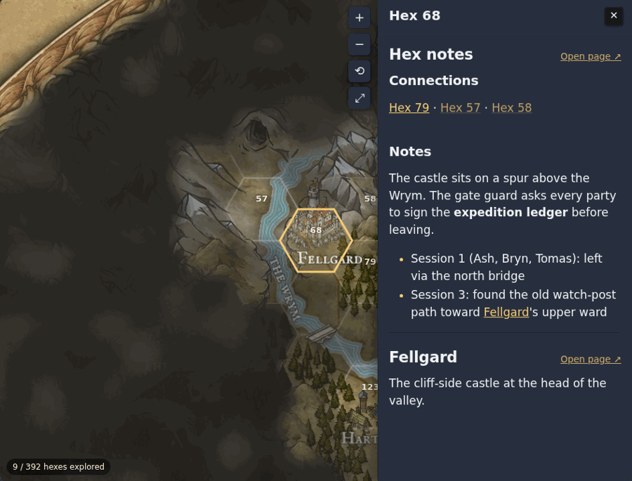

# Hexcrawl Map

A Digital Garden plugin that turns a map image on one note into a pan/zoom hex map with fog of war. Made for the Dunvale West Marches campaign (Greypeaks map), but the grid is configurable.



## What it does

- Drag to pan, scroll/pinch/double-click to zoom, +/−/reset/expand buttons, arrow keys.
- The whole map area is under fog, out to the frame, except explored hexes. Hexes next to an explored one get thinner fog.
- Click an explored hex: a side panel opens on the map with the full text of every published note about it. Links to other hex notes in the panel move the map to that hex. On phones the panel sits under the map (or as a bottom sheet when expanded).
- Click any other hex: small tooltip with its number and "Unexplored".
- `?hex=68` on the map URL zooms to that hex.
- Notes about a hex get a "Hex 68 on the map" link under the title.
- Counter of explored hexes.

## Using it

**Map note** – add `hexmap: true` to its frontmatter and embed the map image. The first image in the note becomes the map.

```yaml
---
dg-publish: true
hexmap: true
hexmap-reveal: 57, 58   # optional: explored hexes that have no note
---
![[greypeaks player.jpg]]
```

**Revealing a hex** – any of these, then publish:

- Publish a note named `Hex 68` (prefix is a setting).
- Add `hex: 68` (or `hex: [70, 80]`) to any published note, e.g. a location note.
- Add the number to `hexmap-reveal` on the map note.

Unpublishing the note puts the fog back.

## Settings

| Setting | Default | Notes |
|---|---|---|
| Hex note prefix | `Hex` | `Hex 68`, `hex-68`, `Hex_068` all match |
| Thin fog next to explored hexes | on | |
| Hex numbers | `explored` | `explored`, `all`, `none` |
| Clicking an explored hex | `panel` | `panel` shows note text on the map; `links` = popup with links |
| Fog colour / opacity | `#1c1914` / `0.97` | |
| Fog coverage | `map` | `map` = out to the frame, `grid` = hexes only, `image` = everything |
| Fog radius | `0.468` | circle fogged in `map` mode, fraction of image width (sits under the Greypeaks frame) |
| Map height | `80vh` | never taller than the image needs |
| Grid orientation | `flat` | `flat` or `pointy` |
| Hex radius | `0.025` | centre-to-corner, fraction of image width |
| Grid origin X / Y | `0.07475` / `0.0000225` | any one hex centre, fraction of image width |
| Circular grid radius | `0.4497` | hexes with centres inside this circle exist; `0` = whole image |

Hexes are numbered in reading order (top row first, left to right, flat-top half-rows counted as rows), which matches Inkarnate/Wonderdraft-style numbered exports. The defaults match the 392-hex Greypeaks map, measured from the numbered export and checked against the vault's hex neighbour lists.

## Limits

- The full map image is published, so a player who opens the image file directly sees it without fog.
- One map per garden (the first note with `hexmap: true` is used for the "on the map" links).
